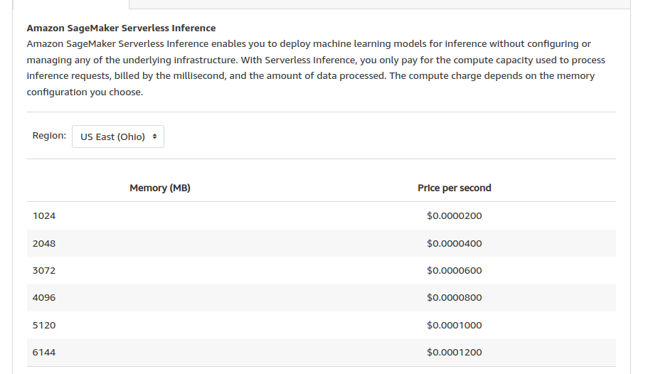
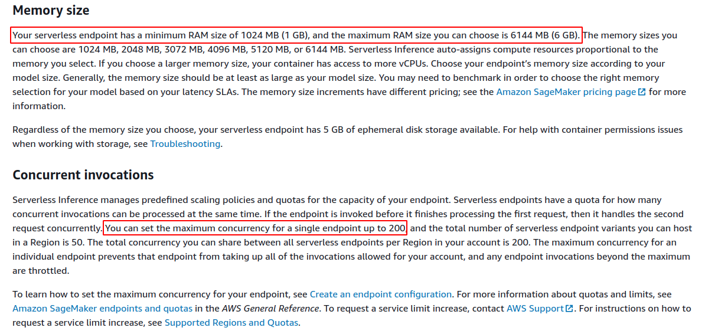

# Sagemaker Serverless Inference

This repository contains infrastructure as code (Cloudformation templates) to deploy a serverless inference endpoint using AWS Sagemaker service. The Idea is to make a performance benchmark for this kind of endpoint and generate son results to see if it is a good strategy to deploy machine learning models.

# Underlying resources and infrastructure

The cloudformation templates will deploy the following resources on AWS.

[x] S3 Bucket to upload and save the model artifact and lambda zip </br>
[x] Lambda to test sagemaker endpoint </br>
[x] Lambda Execution Role with the necessary permissions</br>
[x] Sagemaker Execution Role with the necessary permissions</br>
[x] Sagemaker Model</br>
[x] Sagemaker Serverless Endpoint Config</br>
[x] Sagemaker Serverless Endpoint</br>

# Results

The results of the experiments and benchmark for this kind of model is the following:

## Serverless Endpoint:

Thanks to the serverless configuration the endpoint will not generate any cost if it not in used, the functionality is equal to a lambda function, the main factors are memory allocation and execution time:



## Serverless Limits:

This kind of deployment have concurrent limits; however it is possible to configurate the client, in this case, the lambda function that will execute the sagemaker endpoint, with a `max_attemps` parameter in the retries configuration, in order to make as much retries as possible, the configuration is the following:

```Python
from botocore.config import Config
config = Config(
    read_timeout=900,
    connect_timeout=900,
    retries={
        "max_attempts": 100,
        "mode": "standard"
    }
)
```

with this configuration we can avoid to certain extend the ThrottleError for our client.



## Without the max_attempts and with 10 more concurrent clients above the current limits

The current configuration limits for our serverless endpoint is 150 in `MaxConcurrency`, with this limits we create 160 concurrent false clients. These give the following result:

[160_without_max_attempts](false_sagemaker_clients/results/lambda_execution_05_26_2022_160.csv)

as you can see there are 10 clients with the following error:

```Text
{""errorMessage"": ""An error occurred (ThrottlingException) when calling the InvokeEndpoint operation (reached max retries: 0): None"", ""errorType"": ""ClientError"", ""requestId"": ""6cbb90ea-7d32-44d9-b363-31f5cd782fee"", ""stackTrace"": [""  File \""/var/task/app.py\"", line 21, in handler\n    response = sg.invoke_endpoint(\n"", ""  File \""/var/runtime/botocore/client.py\"", line 391, in _api_call\n    return self._make_api_call(operation_name, kwargs)\n"", ""  File \""/var/runtime/botocore/client.py\"", line 719, in _make_api_call\n    raise error_class(parsed_response, operation_name)\n""]}
```

## With the max_attempts and with 10 more concurrent clients above the current limits

The current configuration limits for our serverless endpoint is 150 in `MaxConcurrency`, with this limits we create 160 concurrent false clients; however in this case we use the `max_attempts` paramter. These give the following result:

[160_with_max_attempts](false_sagemaker_clients/results/lambda_execution_05_28_2022_160.csv)

As you can see in this case we don't have any errors, all our false concurrent clients are responding well and with the expected output prediction.

## More experimentation with false concurrent clients number up to 250

- [170_with_max_attempts](false_sagemaker_clients/results/lambda_execution_05_28_2022_170.csv)</br>
- [180_with_max_attempts](false_sagemaker_clients/results/lambda_execution_05_28_2022_180.csv)</br>
- [250_with_max_attempts](false_sagemaker_clients/results/lambda_execution_05_28_2022_250.csv)
